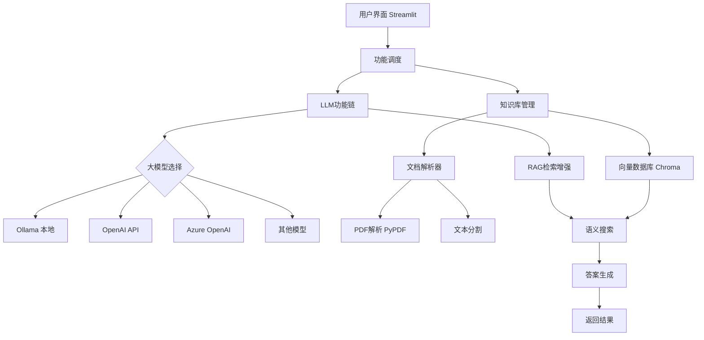

# 📚 AI 科研助手 - 智能文献管理系统

[](https://www.python.org/)
[](https://www.langchain.com/)
[](https://streamlit.io/)
[](https://python.langchain.com/docs/integrations/chat/)

**AI驱动的智能科研文献助手** - 基于RAG技术的跨平台智能文献管理系统，支持多种大语言模型，将个人文献库转化为可交互的知识大脑。

## ✨ 核心功能

### 📤 智能文献管理
- **一键上传**：支持PDF论文自动解析
- **智能元数据提取**：自动识别标题、作者、摘要、关键词等
- **向量化存储**：使用ChromaDB构建语义搜索索引
- **文献统计**：可视化分析论文分布和关键词热度

### 🔍 智能检索与问答
- **语义搜索**：用自然语言描述就能找到相关论文
- **智能问答**：问任何关于已读文献的问题
- **精准定位**：支持按年份、关键词过滤检索结果
- **相关度排序**：基于语义相似度智能排序

### 📝 深度分析工具
- **论文摘要生成**：一键生成结构化论文摘要
- **方法对比分析**：自动对比不同方法/论文的优缺点
- **文献综述生成**：基于知识库自动生成Related Work段落
- **研究头脑风暴**：基于现有文献激发新研究思路

### 🔄 多模型支持
- **全模型兼容**：支持Ollama、OpenAI、Azure OpenAI、Anthropic、Google等主流大模型
- **灵活切换**：通过简单配置即可更换不同模型
- **混合部署**：检索和生成可使用不同模型

## 🚀 快速开始

### 环境要求
- Python 3.9+
- 支持的大语言模型（任选一种）:
  - [Ollama](https://ollama.ai/)（本地部署）
  - [OpenAI API](https://platform.openai.com/)（云端API）
  - [Azure OpenAI](https://azure.microsoft.com/products/ai-services/openai-service)
  - [Google Gemini](https://ai.google.dev/)
  - [Anthropic Claude](https://www.anthropic.com/)
  - 其他LangChain支持的大模型

### 1. 安装依赖
```bash
git clone https://github.com/yourusername/ai-research-assistant.git
cd ai-research-assistant

# 安装核心依赖
pip install -r requirements.txt

# 根据选择的模型安装额外依赖
# 如果使用OpenAI: pip install openai
# 如果使用Azure: pip install openai azure-identity
# 如果使用Anthropic: pip install anthropic
```

### 2. 配置大语言模型（选择一种方式）

#### 方式一：使用Ollama（本地推荐）
```bash
# 安装Ollama
curl -fsSL https://ollama.ai/install.sh | sh

# 下载模型（例如Qwen2.5）
ollama pull qwen2.5:7b
```

编辑 `src/config.py`：
```python
# 使用Ollama模型
LLM_MODEL = "qwen2.5:7b"
EMBEDDING_MODEL = "qwen2.5:7b"
```

#### 方式二：使用OpenAI API（云端）
```bash
# 设置API密钥
export OPENAI_API_KEY="your-api-key-here"
```

编辑 `src/config.py`：
```python
# 切换为OpenAI
from langchain_openai import ChatOpenAI
llm = ChatOpenAI(model="gpt-4", temperature=0.3)
```

#### 方式三：使用其他模型服务
系统支持任何LangChain兼容的模型，配置方式类似。

### 3. 创建必要的目录
```bash
mkdir -p data/papers db/chroma
```

### 4. 运行应用
```bash
streamlit run app.py
```

### 5. 开始使用
1. 打开浏览器访问 `http://localhost:8501`
2. 通过侧边栏上传第一篇论文PDF
3. 等待解析完成
4. 开始使用各种功能！

## 🏗️ 项目结构

```
ai-research-assistant/
├── app.py                 # Streamlit主界面
├── src/                   # 核心代码
│   ├── config.py          # 配置文件（可修改模型设置）
│   ├── chains.py          # LLM功能链
│   ├── knowledge_base.py  # 向量知识库管理
│   └── paper_loader.py    # 论文解析器
├── data/
│   └── papers/            # 上传的论文PDF
├── db/
│   └── chroma/            # 向量数据库存储
├── requirements.txt       # Python依赖
├── .env.example          # 环境变量示例
└── README.md             # 项目说明
```

## 🔧 配置说明

### 模型配置 (src/config.py)
```python
# 主要可配置项 - 可根据需要切换不同模型
LLM_MODEL = "qwen2.5:7b"          # 主模型（可替换为gpt-4, claude-3等）
EMBEDDING_MODEL = "qwen2.5:7b"    # 嵌入模型（可使用text-embedding-ada-002等）
TEMPERATURE = 0.3                 # 生成温度
RETRIEVER_K = 5                   # 检索返回数量
CHUNK_SIZE = 1000                 # 文本分块大小

# 可扩展为支持更多模型提供商
SUPPORTED_MODELS = {
    "ollama": ["qwen2.5:7b", "llama3.2", "mistral", "gemma"],
    "openai": ["gpt-4", "gpt-3.5-turbo"],
    "anthropic": ["claude-3-opus", "claude-3-sonnet"],
    "google": ["gemini-pro"],
    "azure": ["gpt-4", "gpt-35-turbo"]
}
```

### 支持的论文格式
- 📄 PDF格式（主要）
- 📝 纯文本文件（.txt, .md）作为笔记

## 📊 使用指南

### 1. 上传和管理文献
- 通过侧边栏上传PDF论文
- 系统自动解析并索引到知识库
- 在"论文列表"标签页查看所有文献

### 2. 智能问答
- 在"智能问答"标签页输入问题
- 系统基于已读文献给出答案
- 可查看答案的相关原文引用

### 3. 论文总结
- 选择一篇论文，点击"生成总结"
- 获取结构化的摘要报告
- 包括研究问题、方法、结果等

### 4. 对比分析
- 输入对比主题（如"BERT vs GPT"）
- 系统分析相关文献并生成对比表格

### 5. 写作助手
- 输入研究主题，生成文献综述段落
- 进行研究想法的头脑风暴
- 所有生成内容可复制使用

## 🛠️ 技术架构



### 核心组件
1. **文档处理层**：PDF解析、文本分割、元数据提取
2. **向量存储层**：ChromaDB存储和检索嵌入向量
3. **RAG引擎层**：检索增强生成，结合上下文和LLM
4. **模型抽象层**：支持多种大语言模型提供商
5. **应用层**：Streamlit Web界面，用户交互

### 多模型支持架构
系统采用LangChain的模型抽象层，可以无缝切换不同的大语言模型：

```python
# 示例：配置不同的模型提供商
from langchain_openai import ChatOpenAI
from langchain_anthropic import ChatAnthropic
from langchain_google_genai import ChatGoogleGenerativeAI
from langchain_community.chat_models import ChatOllama

# OpenAI配置
llm_openai = ChatOpenAI(model="gpt-4", api_key="your-key")

# Anthropic配置  
llm_claude = ChatAnthropic(model="claude-3-sonnet", api_key="your-key")

# Google配置
llm_gemini = ChatGoogleGenerativeAI(model="gemini-pro", api_key="your-key")

# Ollama配置（默认）
llm_ollama = ChatOllama(model="qwen2.5:7b")
```

## 🤝 参与贡献

欢迎贡献代码、报告问题或提出新功能建议！

### 贡献步骤
1. Fork 项目
2. 创建功能分支 (`git checkout -b feature/AmazingFeature`)
3. 提交更改 (`git commit -m 'Add some AmazingFeature'`)
4. 推送分支 (`git push origin feature/AmazingFeature`)
5. 开启 Pull Request

### 开发计划
- [ ] 支持更多文件格式（Word、Latex）
- [ ] 添加文献引用关系图谱
- [ ] 集成外部学术数据库
- [ ] 增加协作功能
- [ ] 开发移动端应用
- [ ] 添加更多大模型支持

## ❓ 常见问题

### Q: 支持哪些大语言模型？
**A:** 系统支持所有LangChain兼容的大语言模型，包括但不限于：
- **本地模型**：Ollama（Qwen、Llama、Mistral、Gemma等）
- **云端API**：OpenAI GPT系列、Anthropic Claude、Google Gemini
- **企业版**：Azure OpenAI、本地部署的私有模型
- **开源模型**：通过Ollama或本地部署的任何开源模型

### Q: 如何切换不同的大模型？
**A:** 只需修改 `src/config.py` 中的模型配置，并根据需要安装相应的Python包即可。系统架构设计为模型无关，切换模型不影响其他功能。

### Q: 需要什么硬件配置？
**A:** 配置要求取决于选择的模型：
- **Ollama本地模型**：推荐16GB+ RAM，7B模型至少需要8GB内存
- **云端API模型**：只需要网络连接，无特殊硬件要求
- **混合模式**：可以使用云端模型进行生成，本地模型进行检索

### Q: 我的论文数据安全吗？
**A:** 完全安全！系统支持多种部署方式：
- **完全本地**：使用Ollama，数据不出本地
- **混合部署**：敏感检索在本地，生成使用云端API
- **完全云端**：所有处理在云端，适合无本地硬件的情况

### Q: 能处理中文论文吗？
**A:** 是的！系统支持多语言处理，特别是使用Qwen、GPT-4等多语言模型时，对中文论文支持良好。

### Q: 最多能支持多少篇论文？
**A:** 取决于磁盘空间和内存，理论上可以支持上千篇论文。使用云端向量数据库可进一步扩展。

### Q: 如何添加对新模型的支持？
**A:** 系统基于LangChain构建，任何LangChain支持的模型都可以通过简单的配置集成。参考LangChain官方文档添加新模型集成。

## 📄 许可证

本项目采用 MIT 许可证 - 查看 [LICENSE](LICENSE) 文件了解详情。

## 🙏 致谢

- [LangChain](https://github.com/langchain-ai/langchain) - LLM应用框架，提供模型抽象层
- [Ollama](https://ollama.ai/) - 本地大模型运行环境
- [Chroma](https://www.trychroma.com/) - 向量数据库
- [Streamlit](https://streamlit.io/) - 快速构建数据应用
- 所有支持的大模型提供商和开源社区

## 📞 联系方式

如有问题或建议，请通过以下方式联系：
- GitHub Issues: [提交问题](https://github.com/alveynsun/AI-Research-Assistant/issues)
- Email: huangxinqing_0930@126.com

---

**让AI成为你的科研伙伴，提升研究效率10倍！✨**

*如果这个项目对你有帮助，请给个⭐️星标支持！*
