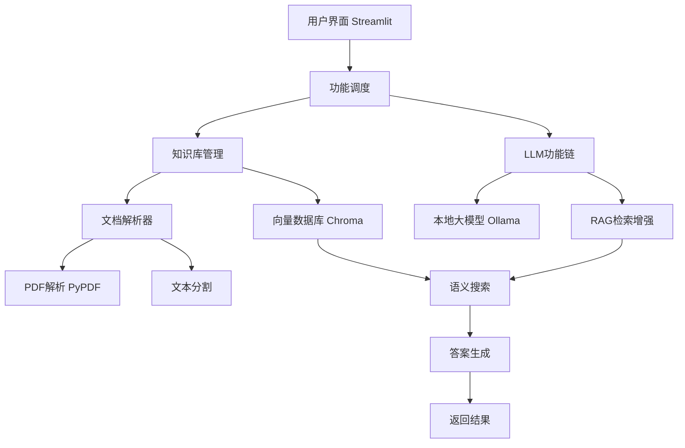

# 📚 AI 科研助手 - 智能文献管理系统

[](https://www.python.org/)
[](https://www.langchain.com/)
[](https://streamlit.io/)
[](https://ollama.ai/)

**AI驱动的智能科研文献助手** - 将个人文献库转化为可交互的知识大脑，基于RAG技术实现智能检索、分析和总结。

## ✨ 核心功能

### 📤 智能文献管理
- **一键上传**：支持PDF论文自动解析
- **智能元数据提取**：自动识别标题、作者、摘要、关键词等
- **向量化存储**：使用ChromaDB构建语义搜索索引
- **文献统计**：可视化分析论文分布和关键词热度

### 🔍 智能检索与问答
- **语义搜索**：用自然语言描述就能找到相关论文
- **智能问答**：问任何关于已读文献的问题
- **精准定位**：支持按年份、关键词过滤检索结果
- **相关度排序**：基于语义相似度智能排序

### 📝 深度分析工具
- **论文摘要生成**：一键生成结构化论文摘要
- **方法对比分析**：自动对比不同方法/论文的优缺点
- **文献综述生成**：基于知识库自动生成Related Work段落
- **研究头脑风暴**：基于现有文献激发新研究思路

### 🎯 特色亮点
- **完全本地化**：使用Ollama本地部署，数据不出本地
- **隐私保护**：所有文献数据存储在本地
- **学术专用**：针对学术论文特点优化处理流程
- **开箱即用**：简单配置即可开始使用

## 🚀 快速开始

### 环境要求
- Python 3.9+
- Ollama (需安装Qwen2.5模型)
- 至少8GB RAM (推荐16GB+)

### 1. 安装Ollama并下载模型
```bash
# 安装Ollama (请参考官方文档)
# https://ollama.ai/

# 下载所需模型
ollama pull qwen2.5:7b
ollama pull nomic-embed-text  # 或使用其他嵌入模型
```

### 2. 克隆项目并安装依赖
```bash
git clone https://github.com/yourusername/ai-research-assistant.git
cd ai-research-assistant

# 安装依赖
pip install -r requirements.txt
```

### 3. 配置项目
```bash
# 创建必要的目录
mkdir -p data/papers db/chroma

# 编辑配置文件 (可选)
# 修改 src/config.py 调整模型和参数
```

### 4. 运行应用
```bash
# 启动Streamlit应用
streamlit run app.py
```

### 5. 开始使用
1. 打开浏览器访问 `http://localhost:8501`
2. 通过侧边栏上传第一篇论文PDF
3. 等待解析完成
4. 开始使用各种功能！

## 🏗️ 项目结构

```
ai-research-assistant/
├── app.py                 # Streamlit主界面
├── src/                   # 核心代码
│   ├── config.py          # 配置文件
│   ├── chains.py          # LLM功能链
│   ├── knowledge_base.py  # 向量知识库管理
│   └── paper_loader.py    # 论文解析器
├── data/
│   └── papers/            # 上传的论文PDF
├── db/
│   └── chroma/            # 向量数据库存储
├── requirements.txt       # Python依赖
└── README.md             # 项目说明
```

## 🔧 配置说明

### 模型配置 (src/config.py)
```python
# 主要可配置项
LLM_MODEL = "qwen2.5:7b"          # 主模型
EMBEDDING_MODEL = "qwen2.5:7b"    # 嵌入模型
TEMPERATURE = 0.3                 # 生成温度
RETRIEVER_K = 5                   # 检索返回数量
CHUNK_SIZE = 1000                 # 文本分块大小
```

### 支持的论文格式
- 📄 PDF格式（主要）
- 📝 纯文本文件（.txt, .md）作为笔记

## 📊 使用指南

### 1. 上传和管理文献
- 通过侧边栏上传PDF论文
- 系统自动解析并索引到知识库
- 在"论文列表"标签页查看所有文献

### 2. 智能问答
- 在"智能问答"标签页输入问题
- 系统基于已读文献给出答案
- 可查看答案的相关原文引用

### 3. 论文总结
- 选择一篇论文，点击"生成总结"
- 获取结构化的摘要报告
- 包括研究问题、方法、结果等

### 4. 对比分析
- 输入对比主题（如"BERT vs GPT"）
- 系统分析相关文献并生成对比表格

### 5. 写作助手
- 输入研究主题，生成文献综述段落
- 进行研究想法的头脑风暴
- 所有生成内容可复制使用

## 🛠️ 技术架构



### 核心组件
1. **文档处理层**：PDF解析、文本分割、元数据提取
2. **向量存储层**：ChromaDB存储和检索嵌入向量
3. **RAG引擎层**：检索增强生成，结合上下文和LLM
4. **应用层**：Streamlit Web界面，用户交互

## 🤝 参与贡献

欢迎贡献代码、报告问题或提出新功能建议！

### 贡献步骤
1. Fork 项目
2. 创建功能分支 (`git checkout -b feature/AmazingFeature`)
3. 提交更改 (`git commit -m 'Add some AmazingFeature'`)
4. 推送分支 (`git push origin feature/AmazingFeature`)
5. 开启 Pull Request

### 开发计划
- [ ] 支持更多文件格式（Word、Latex）
- [ ] 添加文献引用关系图谱
- [ ] 集成外部学术数据库
- [ ] 增加协作功能
- [ ] 开发移动端应用

## ❓ 常见问题

### Q: 需要什么硬件配置？
**A:** 推荐16GB+ RAM，使用Qwen2.5-7B模型至少需要8GB内存。CPU模式可运行，GPU加速效果更佳。

### Q: 支持哪些大语言模型？
**A:** 支持所有Ollama支持的模型，推荐使用7B参数以上的模型以获得更好效果。

### Q: 我的论文数据安全吗？
**A:** 完全安全！所有处理都在本地进行，不会上传到任何云端服务器。

### Q: 能处理中文论文吗？
**A:** 是的！特别是使用Qwen等中文优化模型时，对中文论文支持良好。

### Q: 最多能支持多少篇论文？
**A:** 取决于磁盘空间和内存，理论上可以支持上千篇论文。

## 🙏 致谢

- [LangChain](https://github.com/langchain-ai/langchain) - LLM应用框架
- [Ollama](https://ollama.ai/) - 本地大模型运行环境
- [Chroma](https://www.trychroma.com/) - 向量数据库
- [Streamlit](https://streamlit.io/) - 快速构建数据应用

## 📞 联系方式

如有问题或建议，请通过以下方式联系：
- GitHub Issues: [提交问题](https://github.com/alveynsun/AI-Research-Assistant/issues)
- Email: huangxinqing_0930@126.com

---

**让AI成为你的科研伙伴，提升研究效率10倍！✨**

*如果这个项目对你有帮助，请给个⭐️星标支持！*
